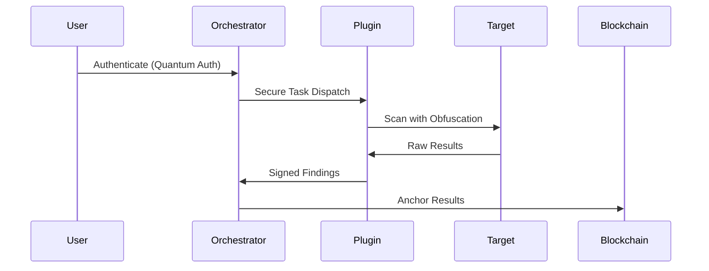

Quantum Security Testing Framework (QSTF)


A next-generation security testing platform combining quantum-resistant cryptography with advanced vulnerability scanning capabilities.

## Key Features

- 🔐 **Quantum-Secured Operations**
  - Post-quantum cryptographic signatures (Kyber/Dilithium)
  - Blockchain-verified audit trails
  - Secure inter-plugin communication

- 🕵️ **Comprehensive Testing Modules**
  ```mermaid
  graph TD
    A[Core Scanner] --> B[Browser Analysis]
    A --> C[Network Scanning]
    A --> D[API Fuzzing]
    A --> E[XSS Detection]
    F[Advanced Modules] --> G[AI Malware Analysis]
    F --> H[SSRF Detection]
    F --> I[Threat Intelligence]
  ```

- 📊 **Enterprise Reporting**
  - PDF reports with quantum signatures
  - Blockchain-anchored results
  - Executive and technical-level outputs

## Installation

### Prerequisites
- Python 3.9+
- Docker (for containerized deployment)
- Chromium (for browser testing)

### Quick Start
```bash
git clone https://github.com/yourrepo/quantum-security-tester.git
cd quantum-security-tester

# Set up environment
python -m venv venv
source venv/bin/activate
pip install -r requirements.txt

# Configure environment
cp .env.example .env
nano .env  # Edit configuration

# Start the system
python -m orchestrator.main
```

## Plugin Architecture

| Plugin | Description | Example Command |
|--------|-------------|------------------|
| `security_testing` | Core vulnerability scanner | `POST /plugins/security_testing {target: "https://example.com"}` |
| `xss_fuzzer` | Advanced DOM XSS detection | `POST /plugins/xss_fuzzer {url: "...", depth: 3}` |
| `ai_malware` | LLM-based code analysis | `POST /plugins/ai_malware {code: "..."}` |
| `threat_intel` | Real-time CVE monitoring | `GET /plugins/threat_intel/check?domain=example.com` |

## Usage Examples

### 1. Running a Security Scan
```bash
curl -X POST \
  -H "Authorization: Bearer YOUR_TOKEN" \
  -H "Content-Type: application/json" \
  -d '{
    "target": "https://example.com",
    "scan_types": ["xss", "network"],
    "security_level": "quantum"
  }' \
  http://localhost:8000/scan/full
```

### 2. Generating a PDF Report
```python
import requests

response = requests.post(
  "http://localhost:8000/reports/generate",
  json={"scan_id": "SCAN_123"},
  headers={"Authorization": "Bearer YOUR_TOKEN"}
)

with open("report.pdf", "wb") as f:
  f.write(response.content)
```

## Deployment Options

### Docker Deployment
```bash
docker build -t quantum-scanner .
docker run -d \
  -p 8000:8000 \
  -v ./quantum-keys:/keys \
  -e AUTH_TOKEN=your-secret-token \
  quantum-scanner
```

### Kubernetes Helm Chart
```bash
helm install qstf ./charts/quantum-scanner \
  --set auth.token="your-token" \
  --set blockchain.enabled=true
```

## Security Model



## Performance Metrics

| Test Type | Avg Execution Time | Max Memory Usage |
|-----------|--------------------|------------------|
| Browser Scan | 45s | 1.2GB |
| Network Audit | 28s | 800MB |
| API Fuzzing | 1m 10s | 1.5GB |

## License

Apache 2.0 - See [LICENSE](LICENSE) for details.

---

> **Warning**: This tool may trigger security alerts on scanned systems. Use only on systems you own or have permission to test.
```
